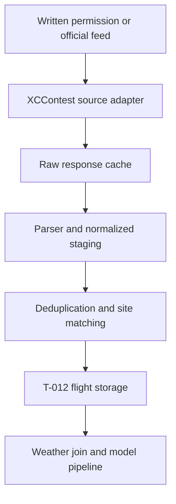

# T-010 — XCContest access and data-fields research

**Project:** Paragliding Forecasts Bulgaria
**Research date:** 2026-07-27
**Task:** T-010 — Research XCContest access and data fields

## 1. Executive conclusion

XCContest is potentially a strong source of positive historical XC examples,
but an automated XCContest scraper should **not** be implemented yet.

The decisive findings are:

1. The intended source is **XCContest.org**, not “XCContent”.
2. XCContest has an official geographic **Worldwide flights search** that
   supports a map centre, radius, “launched inside” versus “intersected area”
   mode, date/season, wing class, route type, average speed, minimum distance,
   pilot and points filters.
3. That search page currently requires an authenticated account. A signed-out
   request returns `401` and the page title says it is for authorized users
   only.
4. XCContest’s current [`robots.txt`](https://www.xcontest.org/robots.txt)
   explicitly disallows automated crawling of:
   - `/world/en/flights-search/` and its translated/season-prefixed variants;
   - `/track.php`, `/trackml.php`, and `/trackmz.php`;
   - URLs containing query strings, except a small explicit allowance for
     pilot-list pagination.
5. No documented public developer API for historical geographic flight search
   was found on the current official site.
6. No official numeric rate limit or crawl delay was published. This does
   **not** mean unlimited access. For the search path, the robots prohibition
   applies before rate is even considered.
7. Exact live XHR endpoints, response schemas and HTML selectors could not be
   verified responsibly: search is authenticated and disallowed to crawlers,
   while an individual detail page presented a verification/login prompt.
8. The safest path is to request written access from XCContest:
   - first choice: official API, export or bulk dataset;
   - second choice: explicit permission for a constrained authenticated
     collector;
   - fallback for Takt 2: a manually exported/validated sample, or a sample from
     SkyNomad after T-011.

This is therefore a **source-access and permission blocker**, not merely a
missing CSS-selector problem.

## 2. Project requirements derived from the supplied documents

The project needs historical paragliding flights for:

- Sofia – Vitosha / Kominite;
- Zlatitsa;
- Sopot;
- Nevsha;
- Shumen;
- Pastrina;
- Dobrich region.

Collection starts with flights of at least 100 km and preserves separate
100+/200+/300+ km labels. The data must be traceable to its source and support
later joining to historical weather by date and project site/region.

The initial project model expects, at minimum:

- `flight_id`;
- flight date;
- pilot/source name when permitted;
- canonical source URL;
- launch/region;
- start coordinates;
- landing coordinates when available;
- distance;
- duration;
- track URL/file when available;
- route type;
- distance band;
- quality/provenance notes.

Relevant accepted project decisions:

- ingestion belongs in the Python data/ML batch pipeline under `services/ml`;
- Python 3.12 and `uv` are used for data/ML work;
- product-facing React and Express code must not scrape the source;
- generated/raw external data stays outside Git;
- only small, sanitized, redistributable fixtures may be committed under
  `data/samples`;
- SQLite remains the MVP storage direction, but T-012—not T-010—owns the first
  flight schema and must still select the access/migration approach;
- T-009 still owns authoritative launch coordinates, aliases and catchment
  radii.

## 3. Official XCContest surfaces relevant to T-010

| Surface                  | URL                                                                                              | Access observed                                                                             | Relevance                                                      |
| ------------------------ | ------------------------------------------------------------------------------------------------ | ------------------------------------------------------------------------------------------- | -------------------------------------------------------------- |
| World flights list       | [`/world/en/flights/`](https://www.xcontest.org/world/en/flights/)                               | Public shell; result table is dynamic/omitted from static HTML                              | General flight discovery, but not a geographic source strategy |
| Worldwide flights search | [`/world/en/flights-search/`](https://www.xcontest.org/world/en/flights-search/)                 | `401` while signed out; explicitly disallowed by robots                                     | Correct UI for centre/radius and historical filters            |
| Flight detail            | Example URL shape: `/world/en/flights/detail:<username>/<date>/<time>`                           | Heading/URL can be public; full detail produced a verification/login prompt during research | Candidate source for per-flight metadata                       |
| Daily PG score           | [`/world/en/flights/daily-score-pg/`](https://www.xcontest.org/world/en/flights/daily-score-pg/) | Public shell; dynamic results not present in static extraction                              | Not a substitute for geographic search                         |
| FAQ                      | [`/world/en/faq/`](https://www.xcontest.org/world/en/faq/)                                       | Public                                                                                      | Official description of geographic search and registration     |
| Rules                    | [`/world/en/rules/`](https://www.xcontest.org/world/en/rules/)                                   | Public                                                                                      | Distance, route/scoring, IGC and season semantics              |
| Registration             | [`/world/en/registration/`](https://www.xcontest.org/world/en/registration/)                     | Public form                                                                                 | Account requirements                                           |
| Privacy policy           | [`/world/en/privacy-policy/`](https://www.xcontest.org/world/en/privacy-policy/)                 | Public                                                                                      | Pilot/track data and privacy considerations                    |
| Robots policy            | [`/robots.txt`](https://www.xcontest.org/robots.txt)                                             | Public text file                                                                            | Binding project policy gate for automated collection           |
| Contact                  | [`/world/en/about/`](https://www.xcontest.org/world/en/about/) and FAQ                           | Public                                                                                      | `info@xcontest.org` and `support@xcontest.org`                 |

### 3.1 How the official geographic search works

The XCContest FAQ states that a user can:

1. find a region on the map;
2. choose the location with the cursor;
3. adjust a circular search radius;
4. search either:
   - flights launched inside the circle; or
   - flights launched elsewhere whose track intersects the circle;
5. apply an XC filter for:
   - exact dates or date ranges;
   - season;
   - wing categories;
   - route types such as free flight or triangle;
   - average speed;
   - minimum distance;
   - pilot;
   - achieved points.

This is the correct functional model for the project. It means XCContest is not
organized only as fixed textual categories for “Sopot”, “Nevsha”, etc.; its own
search already supports coordinate-and-radius discovery.

## 4. Robots, permissions, rate limits and attribution

### 4.1 Verified robots policy

The `robots.txt` response was retrieved on 2026-07-27. Its HTTP metadata showed
`Last-Modified: 2025-12-04` and an ETag. Under `User-agent: *`, it disallows:

- the track delivery paths `/track.php`, `/trackml.php`, `/trackmz.php`;
- the English worldwide flight-search path;
- translated and season-prefixed versions of the same search;
- URLs containing query strings, with narrow pilot-list exceptions.

It does **not** publish `Crawl-delay`.

It also blocks several named AI crawlers from the entire site. That is not the
rule that would govern a dedicated project collector—the wildcard group would—
but it reinforces that source intent must be treated conservatively.

**Decision:** do not build a collector that automates the worldwide flight
search or track download paths unless XCContest gives explicit written
permission or a supported API/export that supersedes this route.

Trying to scrape the daily-score pages and reconstruct geographic search only
to avoid the disallowed search URL would be inefficient and would conflict with
the spirit of the published policy. It is not recommended.

### 4.2 Rate limits

No first-party numeric request limit, quota, `Crawl-delay`, or API limit was
found.

The project must not load-test the site to discover a hidden threshold.
After permission is obtained, ask XCContest to approve:

- allowed endpoints;
- maximum requests per minute/day;
- concurrency;
- backfill window;
- incremental refresh frequency;
- required identification in `User-Agent`;
- behavior for `429`, `Retry-After`, `503` and maintenance windows.

A possible **proposal to send for approval**, not an assumption of permission,
is:

- concurrency `1`;
- at least 3 seconds between requests;
- no repeated detail request when a cached response exists;
- maximum 300 requests per run;
- exponential backoff with jitter;
- immediate stop on repeated `401`, `403`, `429` or verification challenge;
- a project-identifying user agent with a contact email.

### 4.3 Terms, reuse and attribution

No separate current public developer/data-use terms page or explicit dataset
license was found. The competition rules say that an uploaded IGC tracklog
becomes “public property”, but that wording is not precise enough to treat as a
general bulk-download and redistribution licence.

The privacy policy classifies GPS tracklogs/livetracking as location data. It
also explains that information posted in public areas can be seen by users and
may be distributed outside the site. That describes visibility; it is not a
clear licence for a commercial project to bulk-copy profiles and tracks.

Until XCContest responds:

- preserve the canonical XCContest URL for every record;
- attribute visible derived records as “Source: XCContest.org”;
- do not republish raw IGC files;
- do not expose pilots’ names in the product;
- collect pilot identity only if it is genuinely needed for duplicate/quality
  checks, and prefer a source-local opaque identifier;
- store only the coordinates and derived flight features required by the
  model;
- define a process for removing or anonymizing data if a source flight becomes
  private or is deleted.

This report is engineering guidance, not legal advice. Written source
permission is the appropriate risk-control step.

## 5. API findings

### 5.1 First-party API

No documented public first-party API for worldwide historical flights was
found in the current official documentation.

An old XContest news item mentioned an “API interface” as a planned feature,
but no current flight-data API documentation, OpenAPI description, credentials
process or geographic endpoint could be located. It must not be treated as an
available integration.

The permission request should explicitly ask whether a private/partner API,
bulk export or research data feed exists.

### 5.2 Third-party managed wrapper

A third-party service, [Parse’s XContest wrapper](https://parse.bot/marketplace/a2d12269-f900-483e-8ffd-d3dc7f9962b9/xcontest-org-api),
currently exposes some structured XContest-derived data. It is explicitly not
an official XCContest API.

Its advertised coverage includes:

- UK daily PG/HG scores;
- UK pilot/ranking detail;
- per-flight detail;
- current-season world daily PG scores;
- contest lists and UK rules.

Its documented flight fields include numeric ID, string `ident`, pilot,
glider, takeoff, route details, turnpoints, duration, maximum altitude and
tracklog distance. It does not currently return raw IGC files. Its public
description does not provide the Bulgarian centre/radius historical search
required by this project.

Advertised limits on 2026-07-27 were:

| Tier      | Monthly calls | Request rate |
| --------- | ------------: | -----------: |
| Free      |           100 |        5/min |
| Hobby     |         1,000 |       20/min |
| Developer |         5,000 |      100/min |

This wrapper is **not recommended as the primary source** because:

- it does not solve the required Bulgarian geographic backfill;
- it adds a paid/vendor dependency;
- one of its nine endpoints was reported unhealthy at research time;
- it does not resolve XCContest licensing/permission questions;
- its schema is useful evidence, but it is not a first-party contract.

It could be reassessed only if it adds an authorized geographic endpoint and
XCContest confirms the project’s reuse rights.

## 6. Data-field inventory

The table deliberately separates verified first-party evidence from
third-party observations and proposed project fields.

| Project concept            | XCContest representation/evidence                                                                            | Current confidence                                          | Recommended normalized field                                          |
| -------------------------- | ------------------------------------------------------------------------------------------------------------ | ----------------------------------------------------------- | --------------------------------------------------------------------- |
| Stable flight identity     | Detail URL contains username, date and start time; an unofficial wrapper also reports numeric ID and `ident` | URL shape verified; numeric ID not first-party verified     | `source_flight_id`, `source_ident`, `canonical_url`                   |
| Flight date                | Shown in flight cards/detail heading and encoded in the detail URL                                           | Verified                                                    | `flight_date`                                                         |
| Start time                 | Encoded in detail URL/ident                                                                                  | Verified as displayed source time; timezone unverified      | `takeoff_time_raw`, later `takeoff_time_utc` when derived from IGC    |
| Pilot/source name          | Shown in public cards/details                                                                                | Verified but personal data                                  | `pilot_source_id` preferred; `pilot_display_name` nullable/restricted |
| Takeoff                    | Cards show takeoff name and country; search operates around geographic point/radius                          | Verified                                                    | `takeoff_source_id`, `takeoff_name_raw`, `takeoff_country_iso`        |
| Start coordinates          | Needed by project; expected in IGC and geographic search/detail                                              | Existence is plausible but exact extraction is not verified | `start_lat`, `start_lon`                                              |
| Landing coordinates        | Likely derivable from IGC                                                                                    | Not verified in accessible detail                           | `landing_lat`, `landing_lon`                                          |
| Recognized/scored distance | Rules define recognized distance to 0.01 km; public cards show route distance                                | Verified                                                    | `scored_distance_km`                                                  |
| Tracklog path distance     | Advertised by third-party detail wrapper                                                                     | Third-party only                                            | `tracklog_distance_km` nullable                                       |
| Route type                 | Official rules define free flight, free triangle, FAI triangle, closed free triangle and closed FAI triangle | Semantics verified; exact page token/selector unverified    | `route_type`                                                          |
| Points                     | Rules define distance multipliers and two-decimal scoring                                                    | Semantics verified; extraction unverified                   | `score_points` nullable                                               |
| Duration                   | Public cards show flight duration                                                                            | Verified                                                    | `duration_seconds`                                                    |
| Average speed              | Public cards show average speed                                                                              | Verified                                                    | `average_speed_kmh` nullable                                          |
| Maximum altitude           | Public cards show maximum altitude                                                                           | Verified; MSL/AGL semantics need confirmation               | `maximum_altitude_m` nullable plus `altitude_reference`               |
| Glider                     | Third-party wrapper exposes producer/name/FAI class; UI references glider categories                         | Partial                                                     | `glider_name`, `glider_class` nullable                                |
| Route turnpoints           | Official rules describe start, up to three turnpoints and finish; third-party detail exposes them            | Semantics verified; extraction unverified                   | child `route_points` or JSON field after T-012 decision               |
| IGC/track file             | Rules require IGC and altitude record; direct track paths are disallowed by robots                           | Existence verified; download permission not established     | `track_source_url` nullable; no raw file by default                   |
| Source season              | World XContest season runs 1 October–30 September                                                            | Verified                                                    | `source_season`                                                       |
| Distance band              | Internal project label                                                                                       | Derived                                                     | `100_199`, `200_299`, `300_plus`                                      |
| Site match                 | Internal geographic/alias mapping                                                                            | Derived after T-009                                         | `site_id`, `match_method`, `match_distance_km`, `match_quality`       |
| Retrieval provenance       | Internal operational metadata                                                                                | Derived                                                     | `retrieved_at`, `parser_version`, `source_etag/hash`                  |
| Quality notes              | Internal validation result                                                                                   | Derived                                                     | `quality_status`, `quality_notes`                                     |

### 6.1 Important distance decision

XCContest distinguishes scored/recognized route distance from other notions of
distance. Its “PURE 100KM CLUB” also emphasizes straight-line separation rather
than distance optimized over turnpoints.

For this project, the safest default is:

- use **recognized/scored XC distance** for the 100+/200+/300+ labels;
- store tracklog path distance and pure straight-line distance separately when
  available;
- never derive the threshold from points, because route multipliers make points
  non-equivalent to kilometres.

This definition still needs product-owner/pilot confirmation before T-012.

### 6.2 Exact selectors/endpoints

No production selectors or private XHR endpoints are recorded in this report.
Providing guessed selectors would be unsafe because:

- the relevant search page is authenticated;
- it is explicitly disallowed by `robots.txt`;
- its results are dynamic;
- accessible static HTML did not include the data table;
- a detail page displayed a verification/login prompt;
- no permission exists to automate the authenticated surface.

Selectors can be documented only after XCContest approval and an authorized
manual inspection. When that happens, prefer:

1. official structured JSON fields;
2. stable `data-*`, IDs or semantic link attributes;
3. table-header-based mapping;
4. CSS classes only if no semantic contract exists;
5. never positional `nth-child` selectors as the primary parser contract.

Required selector/endpoint evidence for the future implementation:

- result list/table container;
- one flight row;
- canonical detail link;
- source flight ID/ident;
- date/time;
- takeoff ID, name, country and coordinates;
- route type, scored distance and points;
- duration, average speed and altitude;
- pagination/count metadata;
- detail values and track availability;
- “no results”, private/removed flight and verification states.

## 7. How project locations should be queried and matched

The future collector should use **launch-origin matching** for positive
site/date labels.

For each T-009-approved project site:

1. use the approved centre coordinates and radius;
2. choose “flights launched inside the circle”;
3. choose paragliders/PG only;
4. set minimum distance to 100 km;
5. include all route types;
6. select the required date range or XContest season;
7. collect every result page through the supported/approved interface;
8. normalize and deduplicate before assigning the flight to a project site.

The “track intersects the area” mode should not create a positive example for a
site from which the flight did not start. It may be useful later as route or
convergence context, but it must be stored with a different match role.

### 7.1 Site assignment order

Use this priority:

1. exact approved XCContest takeoff ID mapped to a project site;
2. exact normalized takeoff alias from the T-009 alias list;
3. start coordinates inside the approved site/region geometry;
4. manual review.

Store the reason and quality of every match. Do not silently force ambiguous
flights into a site.

### 7.2 Dobrich and overlapping regions

Dobrich is expected to be a regional model rather than one fixed launch.
T-009 must decide whether it is:

- one circular region;
- multiple launch circles;
- a polygon/administrative region;
- a launch cluster.

If two project regions overlap, deduplicate by:

1. XCContest numeric/source ID when available;
2. `ident`;
3. canonical detail URL;
4. IGC hash only when raw-track use is permitted.

Then assign the flight to the explicit takeoff mapping or nearest valid launch;
otherwise mark it `ambiguous` for manual review.

### 7.3 Data-label limitation

XCContest is suitable mainly for **positive evidence**. A date with no public
100+ km flight is not automatically a true negative:

- nobody may have attempted the route;
- the pilot may not use XCContest;
- a flight may be private or uploaded late;
- bad flying can occur despite good atmospheric potential;
- good conditions can exist without a recorded long flight.

The later model should treat absence as unknown or weak-negative evidence
unless exposure/participation is modeled. This is a material selection-bias
risk.

## 8. Recommended implementation architecture after permission



### 8.1 Component ownership

Implement under `services/ml`, not in `apps/api` or the browser:

- `xccontest/client.py` — supported HTTP/API or authorized browser transport;
- `xccontest/parser.py` — source response to source record;
- `xccontest/normalize.py` — source record to language-neutral staging record;
- `xccontest/policy.py` — robots/permission/rate policy gate;
- `xccontest/cli.py` — backfill and incremental commands;
- `tests/fixtures/xccontest/` — only sanitized, permitted fixtures;
- `data/external/xccontest/` — ignored raw cache;
- `data/interim/xccontest/` — ignored normalized staging.

Exact paths can follow the actual Python package name when T-013 starts.

### 8.2 Technology choice

Recommended stack:

- Python 3.12 and `uv`;
- `httpx` for an official/structured HTTP feed;
- Pydantic v2 for strict source and normalized records;
- `selectolax` or `lxml` only if authorized HTML parsing is necessary;
- Python Playwright only if an approved authenticated dynamic workflow cannot
  be accessed through a supported structured endpoint;
- `pytest` for frozen fixture/parser tests;
- standard structured logging with credential/cookie/header redaction.

Do not select a Python ORM in T-010. T-012 owns SQLite schema/access decisions.
The collector can first emit validated JSONL or records at a documented
language-neutral boundary.

### 8.3 Preferred access hierarchy

1. **Official API/bulk export** — use `httpx`; most stable and easiest to test.
2. **Approved authenticated structured endpoint** — use the documented session
   and CSRF mechanism, if XCContest permits it.
3. **Approved authenticated HTML workflow** — use Playwright for navigation and
   parse saved responses; keep request volume minimal.
4. **Manual export/sample** — acceptable for Takt 2 validation while access is
   unresolved.

Credentials, cookies, CSRF tokens, API keys and Playwright storage state must
remain outside Git and logs.

### 8.4 Idempotency and traceability

Each ingestion run should preserve:

- source name and canonical URL;
- retrieval timestamp;
- approved source/permission version;
- source response hash/ETag when available;
- parser version;
- site matching version;
- raw and normalized validation status;
- duplicate decision and reason.

A rerun must update the same flight rather than create another record.

## 9. How and when the collector should run

### 9.1 Current phase

Do not schedule an automated XCContest job yet. Run only:

- policy/permission checks;
- manually supplied fixture parsing;
- a manual import of an authorized export.

### 9.2 Historical backfill after approval

Run one checkpointed backfill by:

- project site/region;
- XContest season or bounded date window;
- minimum 100 km;
- PG only;
- all route types.

The process should be resumable and should not repeat cached detail requests.
Start with Sopot plus one contrasting flatland/northeast region before running
all seven locations.

### 9.3 Incremental refresh after backfill

XCContest rules allow most flights to be claimed up to 14 days after the
flight. A future incremental job should therefore re-check an overlapping
window of at least 16 days rather than only “yesterday”.

For a local MVP, a **weekly** incremental run is sufficient. A daily run adds
little modeling value and more source load. The exact cadence must be approved
by XCContest.

Illustrative future command, not implemented by T-010:

```bash
uv run python -m <package>.ingestion.xccontest backfill \
  --config config/xccontest-sites.yaml \
  --season 2025
```

An incremental command would use the same adapter with a rolling window and
checkpoint file.

## 10. Validation and test strategy

T-015 should create permitted, sanitized fixtures for:

- one normal 100–199.99 km flight;
- one 200–299.99 km flight;
- one 300+ km flight;
- each supported route type;
- missing optional glider/altitude/track fields;
- private/removed/unavailable detail;
- no-results page;
- pagination boundary;
- duplicate flight returned by overlapping regions;
- timezone/date boundary;
- verification/401/403/429 response.

Tests should prove:

- exact units and decimal parsing;
- points are not mistaken for kilometres;
- distance bands are correct at 100, 200 and 300 km;
- source URLs and IDs survive normalization;
- pilot data is omitted/redacted when configured;
- retries stop at the approved limit;
- cached pages are reused;
- robots/permission policy changes fail closed;
- selector drift fails visibly rather than producing plausible zeros.

## 11. Manual verification steps for the project owner

These steps are for confirming the authenticated product after first asking
XCContest whether a read-only research account and automated access are
acceptable.

### 11.1 Registration and login

1. Open the official [registration page](https://www.xcontest.org/world/en/registration/).
2. Registration/World XContest participation is advertised as free; the rules
   state that no entry fee is required.
3. The public form requires:
   - username and password;
   - first and last name;
   - email;
   - country;
   - gender;
   - birthdate;
   - email confirmation after registration.
4. Flying-licence number and CIVL ID are displayed but are not marked mandatory
   on the public form.
5. The competition rules say competitors should hold the required pilot
   licence and insurance. Do not misrepresent your status solely to obtain
   data. Ask `support@xcontest.org` whether a research/read-only account is
   acceptable.

### 11.2 Verify search manually

After authorization and login:

1. Open [Worldwide flights search](https://www.xcontest.org/world/en/flights-search/).
2. Set one test centre/radius, initially Sopot.
3. Choose “launched inside”.
4. Select PG, minimum distance 100 km, all route types, and one short date
   range.
5. Record:
   - whether results are paginated;
   - displayed column headings;
   - one canonical detail URL;
   - one result with and one without a track download;
   - whether start coordinates are visible or only present in the track/map;
   - distance label and route label;
   - time and timezone presentation.

### 11.3 Inspect network/DOM only after permission

In browser developer tools:

1. Open **Network → Fetch/XHR**.
2. Clear the log.
3. Apply one search.
4. Record the request method, endpoint, content type, pagination and response
   shape.
5. Check whether the response is JSON, HTML fragment, or a full page.
6. Inspect one result row and one detail page in **Elements**.
7. Save a sanitized sample response/HTML fragment.

Never share:

- password;
- session cookie;
- authorization header;
- CSRF token;
- full HAR containing account/session data.

If sharing evidence with another developer, remove those values first and use a
short-lived test account approved by XCContest.

### 11.4 Check robots and policies again

Before implementation:

1. open [`robots.txt`](https://www.xcontest.org/robots.txt) manually;
2. save its retrieval date, ETag/Last-Modified and content;
3. compare it with the policy summarized in this report;
4. save XCContest’s written permission and exact conditions in project
   documentation;
5. fail closed if permission or policy no longer covers the chosen endpoint.

## 12. Questions to send to XCContest

Send to `info@xcontest.org`, with `support@xcontest.org` as the website-support
contact:

1. Is there an official API, bulk export or partner feed for historical public
   PG flights filtered by centre/radius, date range and minimum distance?
2. Can the project retrieve Bulgarian 100+ km flights for the seven defined
   regions for model research?
3. If no API exists, will XCContest explicitly permit a low-rate authenticated
   collector despite the current `robots.txt` rule for `flights-search`?
4. Which endpoints are allowed and what are the exact request, concurrency and
   daily limits?
5. What attribution is required?
6. May the project store:
   - flight/source IDs and canonical URLs;
   - date, takeoff and scored distance;
   - derived start/landing coordinates;
   - route type, duration and altitude;
   - raw IGC, or only derived features?
7. May pilot names be omitted/pseudonymized?
8. How should deleted/private flights and data-subject requests be propagated?
9. Are flight date/time and altitude fields documented with timezone and
   MSL/AGL semantics?
10. Can XCContest provide a test account, schema/sample response or export
    example?

## 13. Open questions and dependencies

| Question/dependency                                        | Owner / next task                       | Impact                                 |
| ---------------------------------------------------------- | --------------------------------------- | -------------------------------------- |
| Written XCContest permission or official feed              | New access follow-up before T-013       | Blocks automated XCContest ingestion   |
| Exact rate/quota and allowed user agent                    | XCContest response                      | Blocks scheduling                      |
| Authenticated endpoint and selector evidence               | Manual approved inspection              | Blocks parser implementation           |
| Exact 100+/200+/300+ distance definition                   | Product owner/pilot review before T-012 | Affects labels and backtesting         |
| Final coordinates, aliases and radii                       | T-009                                   | Blocks authoritative site matching     |
| Dobrich geometry/launch cluster definition                 | T-009                                   | Blocks regional query design           |
| SQLite schema/access layer                                 | T-012                                   | Blocks persistent ingestion            |
| Raw IGC reuse permission                                   | XCContest response                      | Determines coordinate/track processing |
| Pilot identity retention policy                            | Product owner + source permission       | Privacy/data-minimization decision     |
| First validated sample source if XCContest remains blocked | T-011/T-013                             | Use manual sample and/or SkyNomad      |

## 14. Recommended backlog follow-ups

1. **XCContest permission request** — send the questions above and retain the
   written answer.
2. **Authenticated manual capture** — after approval, record sanitized network
   and DOM evidence for one search and three representative flights.
3. **T-009 completion** — approve centres, aliases and radii before geographic
   ingestion.
4. **T-012 schema review** — use the field inventory in this report, keeping
   source-only fields nullable until a real sample confirms them.
5. **T-013 source decision**:
   - official XCContest feed if granted;
   - approved manual XCContest sample;
   - or SkyNomad/manual pilot data if XCContest is still blocked.

## 15. T-010 acceptance assessment

| T-010 requirement                  | Result                                                                                      |
| ---------------------------------- | ------------------------------------------------------------------------------------------- |
| Available fields                   | Identified with confidence labels; exact authenticated extractability remains open          |
| Source URLs                        | Identified                                                                                  |
| Access method                      | Authenticated geographic search identified; automation currently blocked by policy          |
| Limitations                        | Documented                                                                                  |
| Attribution needs                  | No explicit licence found; proposed minimum attribution and permission questions documented |
| Rate-limit considerations          | No official numeric limit found; no probing; approval and safe proposal documented          |
| Search strategy for project sites  | Defined around centre/radius and launch-origin matching                                     |
| Exact API/selector contract        | Not available without permission/authenticated manual inspection                            |
| Recommended technologies/run model | Defined consistently with project architecture                                              |

**Recommendation:** move T-010 to `Review`. Do not mark XCContest ingestion
“implementation-ready” and do not start an automated scraper until the access
follow-up is resolved.

## 16. Primary sources

- [XCContest robots.txt](https://www.xcontest.org/robots.txt)
- [XCContest FAQ](https://www.xcontest.org/world/en/faq/)
- [World XContest rules](https://www.xcontest.org/world/en/rules/)
- [XCContest registration](https://www.xcontest.org/world/en/registration/)
- [XCContest privacy policy](https://www.xcontest.org/world/en/privacy-policy/)
- [Worldwide flights search](https://www.xcontest.org/world/en/flights-search/)
- [Registered flights](https://www.xcontest.org/world/en/flights/)
- [About/contact](https://www.xcontest.org/world/en/about/)

Third-party evidence used only for comparison:

- [Parse XContest wrapper](https://parse.bot/marketplace/a2d12269-f900-483e-8ffd-d3dc7f9962b9/xcontest-org-api)
