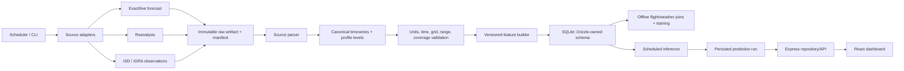

# T-016 — Historical forecast, reanalysis and sounding data research

**Project:** Paragliding Forecasts Bulgaria  
**Research date:** 2026-08-14  
**Task:** T-016 — Research historical forecast archive options  
**Related scope:** project brief §4.2, T-017–T-020, DEC-018  
**Status:** research recommendation; this report does not by itself accept a
source, feature vocabulary or database design

## 1. Executive conclusion

The T-016 acceptance criteria can be answered positively, but not with one
perfect source.

1. **Exact historical model forecasts exist.** The easiest useful archive for
   this project is Open-Meteo's Single Runs API. It preserves an individual
   run, initialization time and full forecast horizon. ECMWF IFS HRES at 9 km
   is available from 2024-03-14; most other integrated models, including
   ICON-EU, are available from 2026-04-02. NOAA also has exact GFS archives,
   with 0.5° forecasts from 2006 and 0.25° output from 2021. TIGGE has
   multi-centre ensemble forecasts from 2006.
2. **There is no convenient free high-resolution archive of every exact
   Bulgarian forecast for the entire likely flight-history period.** Archives
   differ by model, date, resolution, field, licence and access method. Model
   versions also change through time.
3. **ERA5 is the best implementation baseline when an exact forecast is not
   available.** It is free, global, hourly, consistent from 1940, can be
   subsetted by area/time/variable through Copernicus, and contains almost all
   raw fields required by this project. It is reanalysis, not a forecast that a
   user could have seen in advance.
4. **CERRA is the best terrain-resolution experiment.** It covers Europe at
   5.5 km from 1984 and has detailed profiles, but CAPE/CIN/PBL-related soaring
   diagnostics require more derivation. Test it against ERA5 on a small
   Bulgaria sample before accepting the added complexity.
5. **ICON-DREAM-EU is promising but currently awkward.** It is a new 6.5 km
   ICON-family reanalysis from 2010. Public whole-Europe monthly three-
   dimensional GRIB files are very large; a monthly temperature-profile file
   is roughly 6 GB. It is not the first local-first MVP choice without a subset
   service.
6. **Raw sounding support is both useful and feasible without image scraping.**
   NOAA IGRA includes Sofia station `BUM00015614` (WMO 15614) from 1955 to the
   present. It provides vertical temperature/humidity/wind levels plus derived
   LCL, mixed-layer height, CAPE and CIN. A Skew-T picture is a visualization
   derived from these numbers, not an ingestion source.

### 1.1 Proposed MVP source strategy

Use a **source-neutral, dual-track pipeline**:

- **Operational forecast and recent exact-history candidate:** Open-Meteo
  Single Runs with an explicitly selected `ECMWF IFS HRES 9 km` run. Its exact
  archive starts in March 2024, so recent training and daily inference can use
  the same run/lead semantics. This is a _provisional primary_, pending the
  T-017 field-level spike.
- **Higher-resolution comparator:** explicit `DWD ICON-EU` at roughly 7 km.
  Open-Meteo has exact ICON-EU runs only from April 2026; DWD exposes current
  GRIB2 directly. Self-archive every forecast run actually used by the product.
- **Historical fallback:** ERA5 through the Copernicus Climate Data Store,
  always marked `reanalysis`, never presented as an issued forecast.
- **Resolution experiment:** compare ERA5 and CERRA for representative
  Bulgarian sites/days. Promote CERRA only if the terrain benefit is measurable.
- **Observed validation:** NOAA ISD for surface reports and IGRA Sofia for
  upper-air profiles. They validate/calibrate model fields; they do not replace
  future forecasts.
- **Longer exact-forecast research fallback:** NOAA GFS or TIGGE. They are
  valuable for lead-time-aware backtests but too coarse to be the preferred
  operational mountain-site input.

This is deliberately not “train on ERA5 and silently serve ICON”. Preserve
source, model/version, run time, valid time, availability time and lead time.
Treat a source/model change as a distribution change requiring evaluation.

### 1.2 Important schedule correction

A job at 02:00–03:00 `Europe/Sofia` cannot normally use a same-day 00 UTC
global run:

- in summer, 02:30 EEST is 23:30 UTC on the previous date;
- in winter, 02:30 EET is 00:30 UTC;
- a global 00 UTC run becomes available several hours after initialization.

At that hour the deterministic choice is usually the previous 18 UTC run. The
pipeline must select the newest _complete and actually available_ run before
the prediction cutoff, not assume “00Z is ready”. A later morning refresh can
consume the 00 UTC run.

## 2. What the project needs

### 2.1 Three different data roles

| Role               | Question answered                                              | Appropriate source           | Future-dashboard input?                 |
| ------------------ | -------------------------------------------------------------- | ---------------------------- | --------------------------------------- |
| Forecast as issued | What did model run `R` predict for valid time `V` at lead `L`? | exact archived NWP run       | Yes; closest training match             |
| Reanalysis         | What is the best retrospective gridded estimate at `V`?        | ERA5, CERRA, ICON-DREAM      | No; later observations were assimilated |
| Observation        | What did an instrument report at station/time `V`?             | ISD, IGRA, national networks | No; validation/labels only              |

All three are useful, but they are not interchangeable. Reanalysis includes
information that was not available at the original forecast cutoff. Treating
it as an issued forecast creates look-ahead leakage. It remains valuable for:

- the first broad historical atmospheric context;
- deriving/debugging features;
- checking no-flight days;
- validating archived forecasts;
- periods where exact forecasts cannot be recovered;
- a clearly named reanalysis baseline.

### 2.2 Required atmospheric features

The union of project brief §4.2, T-017 and provisional DEC-018 requires:

- provider/model/run provenance, valid time and lead time;
- 2 m temperature and dew point/RH;
- cloud base or a reproducible LCL/cloud-base proxy;
- boundary-layer height;
- thermal strength or a precisely defined proxy;
- wind speed/direction by altitude and vector shear;
- humidity profile, lapse rate and inversions;
- CAPE and CIN with parcel convention;
- low/middle/high/total cloud cover;
- precipitation with accumulation semantics;
- surface/mean-sea-level pressure;
- pressure pattern and convergence over an area;
- optional radiation, sensible heat flux, vertical velocity and TKE inputs.

No source offers a universally comparable field simply called “thermal
strength”. T-017 must define it precisely.

### 2.3 Run and lead semantics

For a value valid at 2026-08-15 12:00 UTC:

```text
runAt       = 2026-08-13T18:00:00Z
validAt     = 2026-08-15T12:00:00Z
leadHours   = 42
availableAt = when completed output became publicly retrievable
retrievedAt = when our collector fetched it
```

All five values matter. `runAt` alone does not prove that a historical run was
available before the product cutoff.

Use lead buckets such as 12–24, 24–48, 48–72 and 72–120 hours. Day-1 and day-5
forecasts are statistically different inputs even if fields share names.

### 2.4 Reanalysis and hindcast

Reanalysis reruns a stable assimilation/model system over many years, combining
historical observations with physics to create a complete grid. It is an
estimate: terrain is smoothed, observing networks change, convection may be
unresolved and preliminary releases may later be revised.

A hindcast is a retrospective forecast using a defined model version and
initialization process. It is consistent, but not necessarily the untouched
bytes of the operational forecast originally issued. Preserve this distinction
in provenance.

## 3. Exact historical/current forecast options

### 3.1 Open-Meteo Historical Forecast API

**Access:** JSON/CSV/XLSX HTTP API, no key on free non-commercial endpoint.  
**Coverage:** mostly 2021/2022 onward, model-dependent. ICON-EU is listed from
2022-11-24; GFS from 2021-03-23; IFS HRES from 2017.  
**Critical semantic:** first hours of successive runs are stitched into one
continuous time series.

This is convenient for near-realized historical model context, but it discards
the complete individual-run structure required for a lead-time backtest. Use
it for exploration/comparison, not as the only training representation for
24–120 hour predictions.

Source: [Historical Forecast API](https://open-meteo.com/en/docs/historical-forecast-api).

### 3.2 Open-Meteo Single Runs API

**Access:** JSON/CSV/XLSX API with `run=YYYY-MM-DDTHH:MM`.  
**Semantics:** selects UTC initialization and returns the complete horizon.  
**Coverage:** IFS HRES 9 km from 2024-03-14; most other models from 2026-04-02.  
**Cadence/horizon:** IFS 00/06/12/18 UTC, 10 days.  
**Availability:** typically 4–6 h after initialization for global models and
1–3 h for regional models.

The API's union exposes temperature/humidity/pressure, clouds, precipitation,
radiation, CAPE, CIN, lifted index, PBL height and pressure-level temperature,
RH, cloud, wind and geopotential. Multiple coordinates can be batched.

The union is **not a guarantee that each field is populated by each model**.
T-017 must query explicit IFS HRES and ICON-EU sample runs and fail on required
gaps rather than allow a `best_match` substitution.

Recommended use:

- provisional exact-history primary from 2024;
- operational exact-run fetch with explicit model/run;
- archive every response/manifest used for prediction;
- preserve both upstream-provider and Open-Meteo transformation provenance.

Source: [Single Runs API](https://open-meteo.com/en/docs/single-runs-api).

### 3.3 Open-Meteo Previous Model Runs API

This API aligns forecasts by fixed offsets: `_previous_day1` is the value
predicted 24 h before valid time, through day 7. Most models are archived from
January 2024; the documented longer exception is GFS 2 m temperature from
March 2021.

It is useful for skill curves and bias correction, but is less suitable as the
canonical source because an individual run is not the primary object and the
exposed variable set is narrower.

Source: [Previous Model Runs API](https://open-meteo.com/en/docs/previous-runs-api).

### 3.4 Direct DWD ICON-EU

**Access:** public HTTPS GRIB2 by cycle/parameter/forecast hour; no account.  
**Resolution/domain:** native 6.5 km, regular output about 7 km; all Bulgaria.  
**Runs:** 00/06/12/18 UTC to +120 h; additional 03/09/15/21 shorter runs.  
**Licence:** DWD open geodata CC BY 4.0, including commercial reuse.

The current public tree includes relevant native products:

- `T_2M`, `TD_2M`, `RELHUM_2M`;
- model-level `T`, `QV`, `RELHUM`, `U`, `V`, `W`, `OMEGA`, `TKE`;
- `CAPE_ML`, `CAPE_CON`, `CIN_ML`;
- `HBAS_CON`, `HTOP_CON`, `CEILING`, `CLDEPTH`;
- `CLCL`, `CLCM`, `CLCH`, `CLCT`, model-level cloud;
- `TOT_PREC`, convective/grid-scale rain/snow;
- `PMSL`, surface/model pressure;
- sensible/latent heat and radiation fluxes.

That raw material covers all required families, although PBL height and thermal
strength may need documented derivations.

Strengths: terrain resolution, exact cycle/hour metadata, very rich fields,
open commercial-safe licence, no intermediary. Weaknesses: no durable deep
public archive, many files, local GRIB/grid/level subsetting, more storage and
operational work.

Recommended role: direct-source fallback and likely long-term commercial-safe
operational source; verification source for an Open-Meteo ICON adapter.

Sources:

- [DWD NWP forecast description](https://www.dwd.de/EN/ourservices/nwp_forecast_data/nwp_forecast_data.html)
- [ICON-EU GRIB tree](https://opendata.dwd.de/weather/nwp/icon-eu/grib/)
- [DWD Open Data](https://www.dwd.de/EN/ourservices/opendata/opendata.html)
- [DWD Open Data FAQ](https://www.dwd.de/DE/leistungen/opendata/faqs_opendata.html)

### 3.5 DWD Pamore

Pamore can subset archived DWD model data by area, vertical layer, time and
element. It offers analyses from archive start and forecasts from approximately
the latest 1.5 years; requested data must be at least 48 h old. Results are
staged to FTP and usually deleted after a week.

It is not a default local-project option:

- registration targets research/education institutions, German authorities
  and disaster-prevention organizations;
- the research registration form lists EUR 235 + VAT/year provision fee;
- access is HTML/query/e-mail/FTP, not a simple public API;
- eligibility and use need explicit approval.

It is still evidence that exact recent ICON archive data exist beyond the
rolling open-data directory.

Sources: [Pamore description](https://www.dwd.de/EN/ourservices/pamore/pamore.html),
[registration form](https://www.dwd.de/EN/ourservices/pamore/pamore_registration.pdf?__blob=publicationFile&v=8).

### 3.6 NOAA GFS exact archives

**Access:** HTTPS, THREDDS, NOMADS, archive orders and public AWS S3; GRIB2.  
**Runs:** 00/06/12/18 UTC.  
**Recent:** 0.25° from 2021, trailing 30-day cloud window.  
**Long archive:** 0.5° forecasts from 2006; roughly two recent years online,
older data through archive access/order services.  
**Licence:** open public NOAA data; attribution requested.

The 0.25° inventory includes 2 m/surface variables, pressure/fixed-altitude
temperature and U/V, geopotential, vertical velocity, multiple CAPE/CIN
definitions, `HPBL`, cloud layers/ceiling/bottom/top, precipitation, sensible
heat, pressure and radiation. Field completeness and run semantics are
excellent.

The problem is terrain: 0.25°/about 28 km does not resolve Bulgarian ridges,
valleys and local convergence; older 0.5° is coarser.

Recommended role: old exact-forecast methodological benchmark and fallback,
not preferred operational site forecast.

Sources:

- [NCEI GFS archive](https://www.ncei.noaa.gov/products/weather-climate-models/global-forecast)
- [GFS AWS Open Data](https://registry.opendata.aws/noaa-gfs-bdp-pds/)
- [NCEP product inventory](https://www.nco.ncep.noaa.gov/pmb/products/gfs/)
- [example field inventory](https://www.nco.ncep.noaa.gov/pmb/products/gfs/gfs.t00z.pgrb2.0p25.f003.shtml)

### 3.7 ECMWF Open Data

ECMWF publishes a free CC BY 4.0 subset of current IFS/AIFS at 0.25° GRIB2,
including four daily cycles, pressure-level temperature/humidity/wind/vertical
velocity/divergence, total cloud, precipitation and most-unstable CAPE.

Only the latest 12 runs (about 2–3 days) are retained. It therefore requires
self-archiving and is not a deep historical solution. Use it for redundancy or
a direct global current feed.

Source: [ECMWF Open Data](https://www.ecmwf.int/en/forecasts/datasets/open-data).

### 3.8 TIGGE

TIGGE has global medium-range ensemble forecasts from thirteen centres from
October 2006. It is available after a 48 h delay through the ECMWF Data Store
in GRIB2 and preserves forecast/ensemble structure.

Fields include 2 m temperature/dew point, 10 m wind, CAPE/CIN, pressure, total
cloud/precipitation, sensible heat, and temperature/humidity/geopotential/U/V
on sparse pressure levels.

Limitations: coarse/variable grids, sparse profiles, no PBL/low-cloud field,
centre/version changes, documented damaged-tape gaps, and mixed licensing.
DWD/ECCC/ECMWF/KMA/NCEP/UKMO contributions are CC BY 4.0; several others are
CC BY-NC 4.0.

Recommended role: old exact ensemble research fallback, not daily primary.

Sources:

- [TIGGE dataset](https://ecds.ecmwf.int/datasets/tigge-forecasts?tab=overview)
- [parameters](https://confluence.ecmwf.int/spaces/TIGGE/pages/40109884/Parameters)
- [licence](https://cds.climate.copernicus.eu/licences/tigge-licence)
- [FAQ](https://confluence.ecmwf.int/spaces/TIGGE/pages/40797492/FAQ)

## 4. Convenience services and scraping assessment

### 4.1 Open-Meteo free constraints

Current free terms allow fewer than 10,000 calls/day, 5,000/hour and
600/minute, only for non-commercial use, with CC BY attribution and no uptime
guarantee. Commercial use needs a paid endpoint; the pricing table currently
places Single Runs in Professional rather than Standard.

These limits are sufficient for tens of batched sites, but they are a business
constraint. Keep a direct-source/paid migration path.

Open-Meteo's metadata API reports last run initialization, conversion completion
and availability. Use it instead of polling full forecast responses.

Sources: [terms](https://open-meteo.com/en/terms),
[pricing](https://open-meteo.com/en/pricing),
[model availability](https://open-meteo.com/en/docs/model-updates).

### 4.2 Windy

Windy's Point Forecast API has ICON-EU/GFS, levels and useful parameters, but
explicitly returns only the latest forecast and no historical runs. Its free
test data is deliberately shuffled/modified and unsuitable for research or
production. The current professional price is EUR 990/year; ECMWF is excluded.

This fails the free-history requirement. Scraping the visualization would lose
structured run metadata and bypass the documented paid interface.

Sources: [pricing](https://api.windy.com/point-forecast/pricing),
[documentation](https://api.windy.com/point-forecast/docs).

### 4.3 meteoblue

meteoblue advertises rich forecast/history APIs and 100+ variables. It says its
history is modelled/simulated rather than measurements and that forecasts are
archived at least daily. Business access is quote-based; non-commercial users
may apply for free access, but this is not an assured public free tier. “History
from 1940” must not be assumed to mean exact forecast-as-issued history.

It can be revisited as a commercial/downscaled provider, not as the transparent
free baseline.

Sources: [Weather APIs](https://content.meteoblue.com/en/business-solutions/weather-apis/),
[history explanation](https://content.meteoblue.com/en/research-education/educational-resources/time-dimensions/history),
[non-commercial application](https://content.meteoblue.com/en/about-us/contact/feedback/developer).

### 4.4 University of Wyoming sounding pages

The Wyoming upper-air site is a familiar sounding UI, but its `robots.txt`
disallows `/cgi-bin`, `/wsgi` and `/upperair/imgs` for all agents. Do not scrape
its interactive output or images and do not OCR Skew-T plots. Use NOAA IGRA or
official model profiles; retain Wyoming only as a manual visual cross-check.

Source: [robots.txt](https://weather.uwyo.edu/robots.txt).

### 4.5 General scraping conclusion

No weather-page scraper is justified for the MVP. Official JSON, GRIB2,
NetCDF and text sources preserve model/cycle, lead, units, levels, quality and
licence metadata. Rendered pages usually lose them. A robots prohibition should
be documented as a rejection, not designed around.

## 5. Reanalysis and observations

### 5.1 ERA5 — recommended baseline

**Coverage:** global 1940–present, hourly, 0.25°.  
**Latency:** preliminary ERA5T about five days; final data 2–3 months later.  
**Access/licence:** CDS API/web subsets, GRIB/NetCDF, CC BY.

Single-level support includes boundary-layer height, cloud-base height, 2 m
temperature/dew point, CAPE, forecast-derived CIN, cloud layers, pressure,
precipitation, sensible heat/radiation and near-surface winds. Pressure levels
provide 37 levels (1000–1 hPa) with temperature, geopotential, U/V, humidity,
vertical velocity, divergence and cloud fraction.

Advantages: long consistent record, near-complete fields, manageable subsets,
strong documentation/licence. Weaknesses: 25–30 km terrain, not issued
forecast, documented occasional extreme CAPE, provider-specific CIN missing
semantics, grid/site elevation mismatch and preliminary-data revision.

Decision proposed: implement first, with `sourceKind = reanalysis` and
preliminary/final status.

Sources:

- [ERA5 single levels](https://cds.climate.copernicus.eu/datasets/reanalysis-era5-single-levels?tab=overview)
- [ERA5 pressure levels](https://cds.climate.copernicus.eu/datasets/reanalysis-era5-pressure-levels?tab=overview)
- [ERA5 field documentation](https://confluence.ecmwf.int/pages/viewpage.action?pageId=239349050)

### 5.2 ERA5-Land

ERA5-Land gives roughly 9 km land/surface context (soil moisture, snow, surface
energy), but lacks the complete upper atmosphere, CAPE/CIN and altitude winds.
It can augment ERA5 later, not replace it.

### 5.3 CERRA — terrain experiment

**Coverage:** Europe, September 1984–present.  
**Resolution:** 5.5 km.  
**Time:** 3-hourly analysis; short forecast hourly +1–6 and 3-hourly +6–30.  
**Vertical:** 29 pressure levels, 1000–1 hPa.  
**Access/licence:** CDS subsets, GRIB2, CC BY.

It provides 2 m T/RH, 10 m wind, cloud layers, pressure, precipitation,
radiation/sensible heat, plus profile T/RH/U/V/geopotential/cloud/TKE. Its
terrain/topography is the main benefit.

Shortcomings: no clearly exposed direct PBL/CAPE/CIN in the catalogue; derive
or leave missing. It is 3-hourly, uses Lambert projection, warns of spatial
gaps, and remains reanalysis.

Decision proposed: compare a small Bulgaria sample with ERA5 and IGRA/ISD.

Sources: [single levels](https://cds.climate.copernicus.eu/datasets/reanalysis-cerra-single-levels?tab=overview),
[pressure levels](https://cds.climate.copernicus.eu/datasets/reanalysis-cerra-pressure-levels?tab=overview).

### 5.4 ICON-DREAM-EU — future candidate

ICON-DREAM is based on DWD's March 2024 ICON system: 13 km global, 6.5 km
Europe, from 2010, hourly, 111 variables, model levels and 37 pressure levels.
The public hourly tree exposes T/P/QV/U/V/wind/TKE, 2 m T/dew point, total
cloud, precipitation and radiation-related fields.

Its obstacle is distribution: parameter-specific monthly whole-Europe GRIB
files, with a monthly 3-D temperature file around 5.5–6.4 GB and no visible
CDS-style subset API. Keep it shortlisted and run an access/subset spike only
if a practical supported route emerges.

Sources: [dataset landing page](https://opendata.dwd.de/climate_environment/CDC/help/landing_pages/doi_landingpage_ICON-DREAM_v1-en.html),
[open directory](https://opendata.dwd.de/climate_environment/REA/ICON-DREAM-EU/),
[hourly parameters](https://opendata.dwd.de/climate_environment/REA/ICON-DREAM-EU/hourly/).

### 5.5 NOAA ISD surface observations

NOAA's Integrated Surface Database has hourly/synoptic reports from more than
20,000 stations and overall records from 1901. It includes wind, temperature,
dew point, clouds, pressure, weather, visibility, precipitation and QC. HTTPS
bulk files and public APIs are available.

Use it to validate surface/model values and precipitation/no-weather cases.
It has uneven station continuity, no full upper-air profile and no future
forecast.

Source: [NOAA Global Hourly/ISD](https://www.ncei.noaa.gov/products/land-based-station/integrated-surface-database).

## 6. Comparative ranking

### 6.1 Exact/current forecasts

| Source                          | Exact history                        | Bulgaria resolution | Field coverage                                   | Access/cost                            | Proposed role                |
| ------------------------------- | ------------------------------------ | ------------------: | ------------------------------------------------ | -------------------------------------- | ---------------------------- |
| Open-Meteo IFS HRES Single Runs | from 2024-03-14                      |                9 km | Near-complete API union; verify per-model fields | Easy JSON; free non-commercial/no SLA  | **Provisional MVP primary**  |
| Open-Meteo ICON-EU Single Runs  | from 2026-04-02                      |               ~7 km | Rich; verify generic fields                      | Easy JSON; same constraints            | Higher-resolution comparator |
| Direct DWD ICON-EU              | live rolling; exact if self-archived |               ~7 km | Excellent CAPE/CIN/cloud/TKE/flux/profile        | Free CC BY GRIB2; more engineering     | Direct/long-term fallback    |
| NOAA GFS                        | 0.25° since 2021; 0.5° since 2006    |           ~28/55 km | Excellent                                        | Free/open GRIB2                        | Old exact-history benchmark  |
| ECMWF Open Data                 | latest 12 runs only                  |    ~25 km open grid | Good basics/profiles, gaps                       | Free CC BY GRIB2                       | Redundant current feed       |
| TIGGE                           | ensemble from 2006, 48 h delay       |     variable/coarse | Partial, sparse profiles                         | Free registration; mixed licence       | Research fallback            |
| DWD Pamore                      | about last 1.5 years                 |        model-native | Excellent potential                              | Restricted + EUR 235/year research fee | Reject as default            |
| Windy                           | none                                 |  provider dependent | current only                                     | altered free data; EUR 990/year        | Reject                       |
| meteoblue                       | historical simulation/current        |          downscaled | rich                                             | quote/application                      | Future commercial option     |

### 6.2 Reanalysis/observations

| Source          | Period/resolution              | Strength                          | Main weakness              | Role                  |
| --------------- | ------------------------------ | --------------------------------- | -------------------------- | --------------------- |
| ERA5            | 1940–present, hourly, 0.25°    | complete, consistent, easy subset | coarse/not issued forecast | **Primary fallback**  |
| CERRA           | 1984–present, 3-hourly, 5.5 km | terrain/profile detail            | derive CAPE/CIN/PBL; gaps  | benchmark             |
| ICON-DREAM-EU   | 2010–present, hourly, 6.5 km   | ICON-family consistency           | huge whole-Europe files    | future candidate      |
| ERA5-Land       | 1950–present, ~9 km land       | surface detail                    | no full atmosphere         | optional augmentation |
| NOAA ISD        | station observations           | real surface validation           | uneven/no upper air        | validation            |
| NOAA IGRA Sofia | 1955–present soundings         | real vertical profile             | one station, sparse times  | T-019/validation      |

Why this ranking:

- IFS HRES initially beats ICON-EU exact history despite ~2 km lower
  resolution because its archive begins two years earlier;
- ERA5 initially beats CERRA despite coarser terrain because its required
  fields/access are more complete;
- GFS beats polished surface APIs for research because it preserves exact
  cycles and full fields, but not high-resolution European models for sites;
- observations validate—they do not become forecast inputs.

## 7. Required-field coverage and derivations

Legend: **D** documented direct field, **C** calculable, **P** proxy/provider-
specific diagnostic, **V** verify for concrete model in T-017.

| Feature              | OM IFS exact    | DWD ICON           | GFS                  | ERA5                | CERRA               | ICON-DREAM public   |
| -------------------- | --------------- | ------------------ | -------------------- | ------------------- | ------------------- | ------------------- |
| 2 m T/Td/RH          | D               | D                  | D                    | D                   | D                   | D                   |
| Cloud base           | C/V             | D + C              | D + C                | D + C               | C                   | C                   |
| PBL height           | V/D             | C from TKE/profile | D                    | D                   | C                   | C                   |
| Thermal strength     | P/C             | P/C flux/TKE/W/PBL | P/C                  | P/C                 | P/C                 | P/C                 |
| Wind by altitude     | D               | D                  | D                    | D                   | D                   | D                   |
| Vector shear         | C               | C                  | C                    | C                   | C                   | C                   |
| Humidity profile     | D               | D                  | D                    | D                   | D                   | D                   |
| Lapse/inversion      | C               | C                  | C                    | C                   | C                   | C                   |
| CAPE                 | V/D             | D                  | D, multiple parcels  | D                   | C                   | C/V                 |
| CIN                  | V/D             | D `CIN_ML`         | D, multiple parcels  | D with caveats      | C                   | C/V                 |
| Cloud layers/total   | D/V             | D                  | D                    | D                   | D                   | total D; layers V/C |
| Precipitation        | D               | D                  | D                    | D                   | D                   | D                   |
| Surface/MSL pressure | D               | D                  | D                    | D                   | D                   | D                   |
| Pressure pattern     | C multi-point   | C grid             | C grid               | C grid              | C grid              | C grid              |
| Convergence          | C neighbourhood | C U/V grid         | C/direct diagnostics | D divergence/C      | C                   | C                   |
| Exact run/lead       | D               | D                  | D                    | not issued forecast | not issued forecast | not issued forecast |

Provider values with identical names are not necessarily comparable. CAPE may
be surface-based, mixed-layer or most-unstable; cloud base may be LCL, ceiling
or convective base; PBL uses provider algorithms.

### 7.1 Cloud base

Do not persist an unexplained `cloudbase_m`. Distinguish provider convective
base, cloud ceiling, surface/mixed-layer LCL, profile cloud bottom, and MSL vs
AGL:

```text
cloudBaseMslM
cloudBaseAglM
cloudBaseMethod = provider_convective | ceiling | surface_lcl |
                  mixed_layer_lcl | profile_cloud_fraction
cloudBaseQuality
```

Compare grid/model elevation with site elevation and flag nonsensical AGL
conversion.

### 7.2 Boundary layer and thermal strength

When PBL is not direct, candidate methods are a potential-temperature
threshold, TKE threshold, bulk Richardson number or parcel mixing height.
Persist `boundaryLayerMethod` and feature-definition version.

“Thermal strength” may use heat flux, PBL depth, virtual potential temperature,
TKE, vertical velocity and lapse rate. A physical convective velocity scale is
conceptually:

```text
w* = ((g / theta_v) * surface_buoyancy_flux * zi)^(1/3)
```

Provider flux sign and accumulation must be normalized correctly. Prefer
separate fields until a definition is accepted:

```text
convectiveVelocityScaleMps
modelMaxUpdraftMps
turbulentKineticEnergyJkg
```

Never mix `w*`, maximum updraft and `sqrt(TKE)` under one name.

### 7.3 Wind, AGL and shear

Pressure levels are not fixed altitudes. Store pressure plus geopotential MSL,
then derive AGL from an explicit elevation reference. Interpolate U/V to
accepted feature heights; calculate direction only for display.

```text
heightAglM = geopotentialHeightMslM - referenceElevationM
shear = sqrt((u2-u1)^2 + (v2-v1)^2) / (z2-z1)
```

Direction wraps at 360° and must not be subtracted as a scalar. T-017 should
choose units (`s^-1` or `m/s per km`) and height bands.

### 7.4 Humidity, lapse, CAPE/CIN

From profile temperature/dew point/RH/geopotential derive environmental lapse,
inversion depth/strength, dew-point depression, dry-layer depth and layer RH.
A surface RH alone is not a profile.

Store CAPE/CIN method:

```text
parcelMethod = surface | mixed_layer | most_unstable | provider_unspecified
calculationMethod = provider | project_profile_v1
```

Keep provider and project-calculated values separately. Missing CIN is not zero.

### 7.5 Clouds, precipitation, pattern and convergence

Preserve cloud layer definitions. For precipitation preserve rate vs
accumulation, start/end, cycle reset, convective/large-scale component and
native unit; normalize to fixed increments later.

Pressure pattern/convergence cannot come from one point. Extract a small
neighbourhood and derive pressure gradient, pressure anomaly, horizontal
divergence `du/dx + dv/dy`, moisture-flux convergence and opposing low-level
flow. Version the footprint/differencing method.

### 7.6 Daytime aggregation

Keep hourly/sub-daily values and aggregate over a DST-aware local flying window:

- maximum PBL and occurrence time;
- maximum/median convective scale;
- minimum cloud-base AGL;
- max/p90 winds and shear;
- maximum CAPE and minimum/most-negative CIN;
- hours beyond precipitation/cloud/wind thresholds;
- pressure/convergence near local midday;
- morning development rate.

## 8. Sounding data

### 8.1 Meaning and value

A sounding is a vertical profile of pressure/height, temperature, humidity and
wind, optionally vertical velocity/cloud/TKE/QC. Relevant kinds:

1. observed balloon radiosonde;
2. future forecast model profile;
3. historical reanalysis pseudo-sounding.

A Skew-T/log-P chart is a visualization of a profile, not another source.

Profiles support LCL/cloud base, mixed/PBL depth, inversions, lapse, LFC/EL,
CAPE/CIN, winds/shear, dry/moist layers and freezing level. Daily future input
must be a **forecast profile**; a future radiosonde does not exist. Historical
radiosondes validate/calibrate model profiles.

### 8.2 NOAA IGRA — recommended observed source

IGRA has >2,800 stations, around 800 near-real-time, plain text over HTTPS/FTP,
full-period/recent/derived files. The station inventory contains:

```text
BUM00015614  42.6500  23.3833  595.0  SOFIA (OBSERV.)  1955  2026
```

A historical Kardzhali station (`BUM00015730`) covers 1966–1991, but Sofia is
the current Bulgarian record found.

Raw levels include pressure, geopotential, temperature, humidity/dew-point
information and wind. Derived files add precipitable water, inversion,
mixed-layer top, freezing level, LCL/LFC/EL, stability indices, CAPE/CIN and
temperature/humidity/wind gradients.

Limitations: one station is not all Bulgarian sites; typically sparse 00/12 UTC
times; balloon drift; instrument/practice changes; missing levels; algorithm-
dependent derived values.

Sources:

- [IGRA product](https://www.ncei.noaa.gov/products/weather-balloon/integrated-global-radiosonde-archive)
- [station inventory](https://www.ncei.noaa.gov/pub/data/igra/igra2-station-list.txt)
- [derived format](https://www.ncei.noaa.gov/pub/data/igra/derived/igra2-derived-format.txt)

### 8.3 Model/reanalysis sounding sources

| Source                      | Type/use                                              |
| --------------------------- | ----------------------------------------------------- |
| Open-Meteo Single Runs      | daily and recent exact-history forecast profile       |
| Direct ICON-EU              | rich native operational profile including TKE/cloud/W |
| ERA5 pressure levels        | long historical baseline/profile                      |
| CERRA pressure/model levels | high-resolution European experiment                   |
| ICON-DREAM-EU               | future ICON-family historical candidate               |
| NOAA GFS                    | older exact forecast fallback, coarse                 |

### 8.4 Is sounding mandatory for the MVP?

T-019 and the project brief put raw sounding/profile handling in the planned
MVP backlog, so **yes, the data capability should be implemented**. But:

- the browser does not need a sounding image in the first MVP;
- OCR/image scraping is not required;
- the minimum useful result is normalized profile levels, derived features,
  provenance and QC;
- a Skew-T PNG can later be generated from stored levels;
- T-019 should reuse the same profile representation created for forecast/
  reanalysis, not invent a second incompatible model.

### 8.5 Processing flow

1. Read station inventory and configure IDs explicitly.
2. Download recent/period-of-record file over HTTPS.
3. Save raw artifact hash/manifest outside Git.
4. Parse headers/levels and preserve source/QC flags.
5. Normalize units and U/V.
6. Validate order, duplicates and physical ranges.
7. Interpolate only supported gaps; never silently extrapolate below surface or
   across large gaps.
8. Derive LCL/LFC/EL, lapse, shear, CAPE/CIN and mixed-layer features with a
   versioned algorithm.
9. Compare against IGRA derived values where both exist.
10. Join to site/day only through explicit time/distance rules and retain Sofia
    provenance.

No meteorological dependency is introduced by T-016. T-019 should decide and
test whether MetPy/equivalent or project formulas are justified.

## 9. Proposed architecture

### 9.1 Shared contract, source-specific adapters

JSON, GRIB/NetCDF and IGRA text cannot share one literal parser. They should
share a canonical atmospheric contract, validation, feature builder and
persistence boundary.



This preserves accepted boundaries: Python owns batch ingestion/features/
models; Drizzle owns migrations; API reads persisted output; web never fetches
weather providers or calculates probabilities.

### 9.2 Adapter contract

```text
SourceAdapter.fetch(request) -> RawArtifactManifest
SourceParser.parse(raw) -> AtmosphericBatch
Normalizer.normalize(batch) -> CanonicalAtmosphericBatch
Validator.validate(batch, policy) -> ValidationReport
FeatureBuilder.build(batch, version) -> FeatureSnapshots
```

Provider code owns URLs/auth/rate limits, native parameter codes, grid/levels,
accumulations, missing/QC and licence. Common code owns canonical units,
UTC/local time, site/grid/elevation, interpolation, physical validation,
versioned formulas and database contract.

### 9.3 Raw reproducibility manifest

Raw payloads live in ignored data zones, not Git or large SQLite blobs. Persist:

```text
provider; dataset/model; sourceKind; request parameters
runAt/analysisAt; availableAt; retrievedAt; valid/lead range
model/cycle version; grid and model orography; selected coordinates
raw path/object key; byte count; SHA-256
licence/attribution; collector/parser version
```

Retain compact JSON responses. For huge reanalysis, retain exact subset request
and subset-file hash, not necessarily every whole-Europe source file.

### 9.4 Proposed T-018 tables

This is a proposal, not a migration from T-016.

- `weather_sources`: provider/dataset/model, source kind (`forecast`,
  `reanalysis`, `surface_observation`, `upper_air_observation`), licence,
  resolution, active status.
- `weather_ingestion_runs`: request scope, start/end/status, raw manifest/hash,
  parser/normalizer version, validation/error. Do not force flight-source
  foreign keys onto weather runs.
- `weather_model_runs`: source/model/version, initialization/reference time,
  availability/retrieval, horizon/cycle/grid, preliminary/final flag.
- `weather_samples`: normalized hourly/surface values keyed by source, optional
  model run, site/grid point and valid time; includes lead, model elevation,
  grid distance and missing/QC.
- `weather_profile_levels`: pressure, geopotential MSL, reference AGL,
  temperature, dew point/RH/specific humidity, U/V/W, cloud, TKE and QC.
- `weather_feature_snapshots`: wide model-ready site/local-date/run/lead bucket
  with feature-definition version, aggregation window, source references,
  missing mask and quality score.

A unique identity needs source/model, initialization/reference time, valid
time/date and feature version. One mutable `site_id + date` row would overwrite
day-5/day-1 runs, different cycles/models, reanalysis and observations and make
backtesting impossible.

### 9.5 Data status vs source kind

Public `mock/manual/baseline/real/missing` describes readiness, not atmospheric
type. Keep orthogonal metadata:

```text
dataStatus = real
sourceKind = forecast | reanalysis | observation
model      = ecmwf_ifs_hres
runAt      = ...
leadHours  = ...
```

## 10. Daily operational loop

### 10.1 Availability-aware schedule

| Sofia time             | Action                | Policy                                                                |
| ---------------------- | --------------------- | --------------------------------------------------------------------- |
| 02:30                  | primary nightly batch | newest complete run before cutoff, usually previous 18 UTC global run |
| 06:30–09:00            | optional refresh      | new 00 UTC run only after metadata says complete                      |
| every 3 h/event        | optional incremental  | only when a new run exists                                            |
| after history backfill | offline training      | never in browser request path                                         |

Measure actual provider availability over weeks before fixing the later refresh.

### 10.2 Sequence

1. Resolve configured source/model/sites.
2. Query metadata/manifest.
3. Select newest run complete before cutoff.
4. Fetch horizon, variables, profiles and neighbourhood in bounded batches.
5. Store raw response/manifest.
6. Validate run identity, time axis, fields, units, null ratio, elevation and
   lead coverage.
7. Normalize/persist idempotently.
8. Build versioned feature snapshots.
9. Infer only when required policy passes.
10. Persist prediction linked to features/model artifact.
11. API exposes latest success; on failure retain prior success and show age.

Use deterministic identity `(source, model, runAt, footprintVersion,
variableSetVersion)`. Batch coordinates, back off with jitter, obey
`Retry-After`, stop on repeated 401/403/429, never silently use `best_match`,
and expose selected run/fetch age.

## 11. Training/evaluation implications

### 11.1 Lead-matched training

For each historical site/day:

1. define historical prediction cutoff in `Europe/Sofia`;
2. select only a run available before cutoff;
3. use the production-equivalent lead bucket;
4. run the same versioned feature code;
5. preserve model/version;
6. compare later reanalysis/observations for verification, not input.

This prevents training on near-analysis data and serving day-3 forecasts.

### 11.2 Reanalysis baseline and source shift

If exact history is sparse, train `reanalysis_baseline_v1`. Its score is an
optimistic upper bound for the forecast-driven product. Evaluate:

- reanalysis features → recorded flight outcome;
- exact forecast features → outcome;
- forecast-to-reanalysis error by lead/site/season.

Training on ERA5 and serving IFS/ICON creates covariate shift. Mitigate with
common physical derivations, source/version metadata, source-specific
calibration/models, overlapping-period bias checks and separate backtests. Do
not merge provider-native CAPE/PBL/thermal fields without method tags.

### 11.3 No flight is not automatically bad weather

No recorded 100+ km flight may mean bad weather, weekday/no pilots, closure,
missing track, good local but not 100 km conditions, incomplete coverage or a
season/site effect. Use an honest target such as
`recorded_100km_flight_at_site_day`, not `safe` or `flyable`.

Negative sampling should restrict season/exposure, assess flight-source
completeness, include calendar effects, distinguish no-record from observed
adverse weather, and avoid safety guarantees. A successful flight does not
prove conditions were safe for everyone.

## 12. Licence, reliability and safety

### 12.1 Licence summary

- Open-Meteo free service: non-commercial, CC BY attribution, numeric limits,
  no SLA; paid professional path for commercial Single Runs.
- DWD open geodata/ICON/ICON-DREAM: CC BY 4.0 with attribution.
- ERA5/CERRA: Copernicus CC BY dataset licence; register/accept current terms.
- NOAA/NODD: public use as desired; attribution requested, no endorsement.
- TIGGE: licence depends on centre; store centre-level licence.
- ISD/IGRA: official NOAA data; preserve dataset/station/QC attribution.

Attribution must flow to the product/documentation and raw manifest. This is
engineering research, not legal advice; re-check terms before a commercial
launch.

### 12.2 Reliability and fallback

Free API availability is not a safety/reliability guarantee. The system should:

- preserve latest successful forecasts/predictions with staleness;
- never fabricate missing weather or probabilities;
- surface source/run/age;
- distinguish collector failure from meteorological missingness;
- keep provider adapters replaceable;
- never present the product as aviation weather or a safety guarantee.

## 13. Recommended next implementation work

### 13.1 T-017 data spike before accepting fields

Use representative locations (mountain, flatland, northeast/coast) and dates
(strong XC, marginal, precip/overcast), with 24/48/72/120 h leads.

1. Request exact IFS HRES Single Runs from Open-Meteo.
2. Request exact ICON-EU where archive dates allow.
3. Fetch matching ERA5 single/pressure levels.
4. Fetch one matching CERRA subset.
5. Fetch matching IGRA Sofia 00/12 UTC profiles when available.
6. Optionally fetch direct DWD ICON fields for one run.
7. Produce a machine-readable field catalogue: native name, units, direct/
   derived, parcel/method, temporal semantics, missing values and licence.
8. Compare grid/model elevation with launch elevation.
9. Measure payload/call/download/storage cost.
10. Verify that explicit models never fall back silently.

Acceptance gate for provisional IFS primary:

- exact `runAt/validAt/lead` verified;
- profile T/RH/wind/geopotential available;
- surface T/Td, pressure, cloud, precipitation available;
- CAPE/CIN/PBL present or an accepted derivation is feasible;
- repeatable response and licence attribution captured;
- no unacceptable nulls for Bulgarian points/horizons.

### 13.2 T-018 schema spike

- Drizzle owns migrations; Python uses a non-migrating adapter.
- Persist multiple runs; do not overwrite by date.
- Include source kind, run/reference/availability/retrieval, valid/lead, grid
  point/orography, units/methods/QC, raw hash and feature version.
- Store profile levels plus model-ready snapshots.
- Add idempotency, foreign-key and run/valid-time constraint tests.

### 13.3 T-019 sounding scope

- IGRA Sofia recent/full-period fixture with source/QC fields;
- reusable profile-level contract;
- versioned LCL/lapse/shear/CAPE/CIN derivation;
- compare project derivations with IGRA derived values;
- explicitly defer image scraping/OCR;
- optionally generate Skew-T only from raw parsed levels later.

### 13.4 Future decision checkpoints

1. Is Open-Meteo free non-commercial status compatible with intended launch?
2. Does IFS HRES expose every accepted T-017 field for all lead hours?
3. Does CERRA materially outperform ERA5 for Bulgarian terrain?
4. Is direct ICON-EU GRIB cost acceptable for commercial-safe operation?
5. How much exact history exists for the final flight-training date range?
6. What fixed prediction cutoff and refresh schedule will the product promise?
7. Which code/module owns prediction schema, still open after DEC-018?

## 14. Direct answers to T-016 and related questions

### Is exact historical forecast data available?

**Yes, partially.** Open-Meteo Single Runs gives easy exact IFS HRES from March
2024 and most models from April 2026. GFS/TIGGE provide older exact runs at
coarser resolution. DWD Pamore has recent exact model archive but is restricted
and not free in the practical sense for this project.

### What fallback should be used when it is not?

**ERA5 first**, clearly labelled reanalysis. Test CERRA as a 5.5 km terrain
upgrade. Keep ICON-DREAM-EU as a future same-family candidate when subsetting is
practical.

### Can one source provide history and current forecasts?

Open-Meteo Single Runs can do both for covered periods/models. It cannot solve
all older history and its free service is non-commercial/no-SLA. A dual-source
architecture remains necessary.

### Can two collectors share parser/normalizer/validation/persistence?

They should share the canonical normalized contract, validator, feature
builder and persistence. They cannot share one literal parser because JSON,
GRIB/NetCDF and fixed-width sounding files differ. Source adapters isolate that
difference.

### What is reanalysis?

A retrospective, physically consistent gridded reconstruction produced by
assimilating historical observations into a model. It is usually the best
available estimate of what happened, not what was forecast in advance.

### What is sounding data and is it needed?

It is a vertical atmospheric profile used for cloud base, PBL/inversions,
CAPE/CIN, lapse, humidity and wind/shear. Raw profile handling is in the MVP
backlog and useful; image scraping/display is not mandatory. Use forecast
profiles operationally and IGRA Sofia/reanalysis profiles historically.

### What should the 02:00–03:00 job use?

The newest complete run available before the cutoff, commonly previous 18 UTC
for a global model. Add a later refresh for 00 UTC rather than pretending it is
available at 02:30 Sofia.

## 15. Final proposed decision, not yet accepted

Proceed to T-017 with:

1. `Open-Meteo Single Runs / ECMWF IFS HRES 9 km` as provisional exact/live
   primary;
2. `ERA5` as provisional reanalysis baseline;
3. `CERRA` as a bounded resolution comparison;
4. `DWD ICON-EU` as high-resolution/direct comparator and migration path;
5. `NOAA IGRA Sofia` for observed upper-air validation;
6. source-neutral run/profile/feature contracts that preserve full provenance.

Do not accept a final source, schema or thermal/PBL/cloud-base definition until
the T-017 sample verifies actual values, missingness, units, model/run identity,
payload cost and licence fit.

## 16. Official source index

### Open-Meteo

- [Historical Forecast API](https://open-meteo.com/en/docs/historical-forecast-api)
- [Single Runs API](https://open-meteo.com/en/docs/single-runs-api)
- [Previous Model Runs API](https://open-meteo.com/en/docs/previous-runs-api)
- [DWD ICON API/field documentation](https://open-meteo.com/en/docs/dwd-api)
- [model availability metadata](https://open-meteo.com/en/docs/model-updates)
- [terms](https://open-meteo.com/en/terms)
- [pricing](https://open-meteo.com/en/pricing)

### DWD

- [NWP forecast data](https://www.dwd.de/EN/ourservices/nwp_forecast_data/nwp_forecast_data.html)
- [ICON-EU GRIB directory](https://opendata.dwd.de/weather/nwp/icon-eu/grib/)
- [Open Data](https://www.dwd.de/EN/ourservices/opendata/opendata.html)
- [Pamore](https://www.dwd.de/EN/ourservices/pamore/pamore.html)
- [ICON-DREAM landing page](https://opendata.dwd.de/climate_environment/CDC/help/landing_pages/doi_landingpage_ICON-DREAM_v1-en.html)
- [ICON-DREAM-EU directory](https://opendata.dwd.de/climate_environment/REA/ICON-DREAM-EU/)

### Copernicus/ECMWF

- [ERA5 single levels](https://cds.climate.copernicus.eu/datasets/reanalysis-era5-single-levels?tab=overview)
- [ERA5 pressure levels](https://cds.climate.copernicus.eu/datasets/reanalysis-era5-pressure-levels?tab=overview)
- [ERA5 documentation](https://confluence.ecmwf.int/pages/viewpage.action?pageId=239349050)
- [CERRA single levels](https://cds.climate.copernicus.eu/datasets/reanalysis-cerra-single-levels?tab=overview)
- [CERRA pressure levels](https://cds.climate.copernicus.eu/datasets/reanalysis-cerra-pressure-levels?tab=overview)
- [ECMWF Open Data](https://www.ecmwf.int/en/forecasts/datasets/open-data)
- [TIGGE dataset](https://ecds.ecmwf.int/datasets/tigge-forecasts?tab=overview)
- [TIGGE parameters](https://confluence.ecmwf.int/spaces/TIGGE/pages/40109884/Parameters)
- [TIGGE licence](https://cds.climate.copernicus.eu/licences/tigge-licence)

### NOAA

- [GFS archive](https://www.ncei.noaa.gov/products/weather-climate-models/global-forecast)
- [GFS AWS Open Data](https://registry.opendata.aws/noaa-gfs-bdp-pds/)
- [GFS product inventory](https://www.nco.ncep.noaa.gov/pmb/products/gfs/)
- [Global Hourly/ISD](https://www.ncei.noaa.gov/products/land-based-station/integrated-surface-database)
- [IGRA](https://www.ncei.noaa.gov/products/weather-balloon/integrated-global-radiosonde-archive)
- [IGRA stations](https://www.ncei.noaa.gov/pub/data/igra/igra2-station-list.txt)
- [IGRA derived format](https://www.ncei.noaa.gov/pub/data/igra/derived/igra2-derived-format.txt)

### Evaluated commercial/convenience interfaces

- [Windy Point Forecast pricing](https://api.windy.com/point-forecast/pricing)
- [Windy Point Forecast docs](https://api.windy.com/point-forecast/docs)
- [meteoblue APIs](https://content.meteoblue.com/en/business-solutions/weather-apis/)
- [meteoblue history](https://content.meteoblue.com/en/research-education/educational-resources/time-dimensions/history)
- [Wyoming robots policy](https://weather.uwyo.edu/robots.txt)
